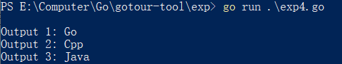
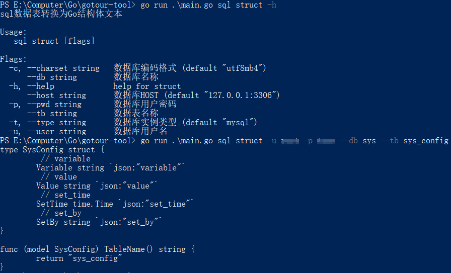

# 02.CLI应用
* 使用 Cobra 库构建的CLI应用
* 应用主要包括3个部分: 单词格式转换, 简单时间处理, 数据表到结构体转换
## 项目结构
```
gotour-tool
|-- main.go
|-- go.mod
|-- go.sum
|-- cmd    //命令行接口
    |-- root.go    //根命令
    |-- word.go
    |-- time.go
    |-- sql.go
|-- internal    //内部实现
    |-- word
        |-- word.go
    |-- timer
        |-- time.go
    |-- sql2struct
        |-- mysql.go
        |-- template.go
```
* 项目最外层主要为源文件 `main.go`, 作为整个程序的启动入口.
* `cmd`目录下为使用 Cobra 库实现的命令行接口, 每一个文件对应一个命令集合. 其中, `root.go`为根命令, 即整个程序的命令集合. 接下来3个对应着程序的3个功能, 作为子命令, 都会被添加到根命令中.
* `internal`目录下为具体功能实现的源文件, 又细分了3个子目录, 分别对应程序的3个功能

## 功能实现
### 单词格式转换
#### 概述
单词格式转换主要是对字符串的格式进行转换处理.   
主要包括: 单词全部转为大/小写, 下划线单词转为大写驼峰单词, 下划线单词转为小写驼峰单词, 驼峰单词转为下划线单词.
#### 处理函数
处理函数即上述几种转换类型对应的函数, 其实现较为简单在此不赘述, 其函数定义如下:
* `func ToUpper(s string) string`: 单词转为大写
* `func ToLower(s string) string `: 单词转为小写
* `func UnderscoreToUpperCamelCase(s string) string`: 下划线单词转为大写驼峰单词
* `func UnderscoreToLowerCamelCase(s string) string`: 下划线单词转为小写驼峰单词
* `func CamelCaseToUnderscore(s string) string`: 驼峰单词转为下划线单词
#### 命令行参数
* 该功能对应子命令 `word`, 对应命令集合结构体 `wordCmd`.
* 设定的参数一个是`str`表示待处理的字符串, `mode`表示处理的模式. 其中处理模式`mode`是有多个处理模式, 此处便使用一个整数来代表, 在 `wordCmd.Run`中定义的函数中则使用 `swtich` 语句来判断具体的模式.
```go
const (
	ModeUpper = iota + 1
	ModeLower
	ModeUnderscoreToUpperCamelCase
	ModeUnderscoreToLowerCamelCase
	ModeCamelCaseToUnderscore
)
```
### 时间处理
时间处理主要包括两个功能: 获取当前时间, 以及计算一个时间加上一个时间段的值.
#### 处理函数
* `func GetNowTime() time.Time`: 获取当前时间
* `func GetCalculateTime(curTime time.Time, duration string) (time.Time, error)`: 在当前时间上加上一个时间段
#### 命令行参数
* 该功能对应子命令 `time`, 对应命令集合 `timeCmd`. 而其下两个功能由于所需的参数不一致, 因此有分成了两个子命令 `now`(`nowTimeCmd`) 和 `calc`(`calculateTimeCmd`) 分别对应获取当前时间和计算时间的两个功能.
* `nowTimeCmd.Run`: 对应获取当前时间的功能, 其不需要参数, 可直接执行, 因此 `Run` 成员中便直接调用 `GetNowTime()` 函数即可.
* `calculateTimeCmd.Run`: 对应计算时间的功能, 需要两个字符串参数分别对应要计算的时间 `calcTime` 以及增加的时间段 `duration`. 因此在调用 `GetCalculateTime()`函数前很重要一步是对字符串进行转换, 转换成Go中的时间结构, 在这个过程中也要判断字符串是否合法, 以确保转换的正确性.
##### `calculateTimeCmd.Run`
```Go
var calculateTimeCmd = &cobra.Command{
    ...
	Run: func(cmd *cobra.Command, args []string) {
		//fmt.Println(calcTime, duration)
		var curTime time.Time
		var layout = "2006-01-02 15:04:05" //时间处理格式
		location, _ := time.LoadLocation("Asia/Shanghai")
		if calcTime == "" { //待计算时间为空则视为当前时间
			curTime = time.Now().In(location)
		} else {
			//通过calcTime空格数确定时间格式
			if space := strings.Count(calcTime, " "); space == 0 {
				layout = "2006-01-02"
			}
			var err error
			//按照给定时间格式处理待计算时间字符串
			curTime, err = time.ParseInLocation(layout, calcTime, location)
			//若解析错误, 则尝试将当前时间作为Unix时间戳
			if err != nil {
				t, err := strconv.Atoi(calcTime)
				//转换为时间戳出错则报错退出
				if err != nil {
					log.Fatalf("calcTime err: %v\n%s", calcTime, calcDesc)
				}
				curTime = time.Unix(int64(t), 0).In(location)
			}
		}
		//进行时间计算
		t, err := timer.GetCalculateTime(curTime, duration)
		if err != nil {
			log.Fatalf("timer.CalculateTime err: %v", err)
		}
		fmt.Printf("输出结果: %s, %d", t.Format(layout), t.Unix())
	},
}
```
* 首先判断是否输入了时间字符串, 如果没有则直接使用当前时间作为随机字符串.
* 接着使用 `strings.Contains()` 函数来判断给定的时间字符串是否带有空格, 并据此来设定计算结果的时间字符串的格式.
* 使用 `time.ParseInLocation()` 函数将给定的时间字符串转换到当前时区下的时间结构体. 需要注意的是, Go默认会使用UTC时间, 如果有一处使用了带时区的时间(比如上面的`time.Now().In(location)`), 则需要所有时间都要统一使用带时区的时间, 以防止Go转换过程中出现时间的不一致. 为了保证时间的一致性, 此处使用东八区的时间, 通过`time.LoadLocation("Asia/Shanghai")`进行了设定.
* 若时间解析错误, 则在尝试将输入视为Unix时间戳(即一个整数, 表示从1970年1月1日UTC 00:00:00 开始所经过的秒数)进行转换, 若仍转换失败则表示输入的时间有误, 报错退出.
* 最后使用 `GetCalculateTime()` 函数计算时间并输出.
##### 标准库函数
该部分代码中涉及了和标准库 `time` 相关的函数
* `func Now() Time`: 返回当前本地时间
* `func (t Time) In(loc *Location) Time`: 返回采用`loc`指定的地点和时区的时间
* `func LoadLocation(name string) (*Location, error)`: 返回使用给定的名字创建的Location
* `func ParseInLocation(layout, value string, loc *Location) (Time, error)`: 解析一个格式化的时间字符串并返回它代表的时间, 该时间会使用提供的`loc`时区来解析.
* `func Unix(sec int64, nsec int64) Time`: 用Unix时间戳来创建一个本地时间, 对应sec和nsec表示的Unix时间. 参数是二选一的, 不使用的参数置为0.
* `func (t Time) Unix() int64`:将时间`t`表示为Unix时间戳的形式
* `func ParseDuration(s string) (Duration, error)`: 解析一个时间段字符串, 合法的单位有"ns"、"us" /"µs"、"ms"、"s"、"m"、"h".
* `func (t Time) Add(d Duration) Time`:返回时间点 `t+d`
* 时间格式字符串`2006-01-02 15:04:05`: 类比其他语言的时间格式化字符串`yyyy-MM-dd HH:mm:ss`, Go中使用了固定数值的时间字符串, 不能使用其他数值来表示, 否则转换会出错.

### 数据表到结构体转换
数据表到结构体转换主要是实现了将MySQL数据表及其字段信息转换为Go语言结构体及其成员, 即自动化生成数据表对应的Go结构体的代码文本.
#### 标准库 text/template 使用
在转换过程中使用了Go语言内置的模板库`text/template`, 主要用于模板渲染, 生成相应的文本.  
GoTour-Tool/exp/exp4.go
```go
package main

import (
	"os"
	"strings"
	"text/template"
)

const templateText = `
Output 1: {{title .Name1}}
Output 2: {{title .Name2}}
Output 3: {{.Name3 | title}}
`

func main() {
	funcMap := template.FuncMap{"title": strings.Title}
	tpl := template.New("go tour")
	tpl, _ = tpl.Funcs(funcMap).Parse(templateText)
	data := map[string]string{
		"Name1": "go",
		"Name2": "cpp",
		"Name3": "java",
	}
	_ = tpl.Execute(os.Stdout, data)
}
```
* 如上定义了简单的代码文本 `templateText`, 其中双大括号`{{}}`中包括的为待替换的参数.
* 使用 `template.FuncMap`设定了模板中的自定义函数, 并使用`(*Template).Funcs()`函数将其添加到了模板中. 再观察给定的代码文本 `templateText`, `{{title .Name1}}`和 `{{.Name1 | title}}`实际上都是通过执行了`title`对应的函数, 参数为`.Name1`. 前者是类似于直接调用; 而后者是使用了`|`, 类似于Linux中的管道.
* 在使用 `(*Template).Parse()`解析了模板后, 调用 `(*Template).Execute()`进行执行, 便可以将输入的`data`值加载进模板, 并得到渲染后的模板输出到控制台`os.Stdout`上.  

#### 连接数据库
要获取数据库中数据表的信息, 首先要连接到数据库.  
GoTour-Tool/internal/sql2struct/mysql.go  

```go
//数据库模型
type DBModel struct {
    ...
}
//数据库基本信息
type DBInfo struct {
    ...
}
//数据表字段信息
type TableColumn struct {
    ...
}

//连接数据库
func (m *DBModel) Connect() error {
	var err error
	dsn := fmt.Sprintf(
		"%s:%s@tcp(%s)/information_schema?"+
			"charset=%s&parseTime=True&loc=Local",
		m.DBInfo.Username,
		m.DBInfo.Password,
		m.DBInfo.Host,
		m.DBInfo.Charset,
	)
	//连接数据库
	m.DBEngine, err = sql.Open(m.DBInfo.DBType, dsn)
	if err != nil {
		return err
	}
	return nil
}
```
* 首先定义了数据库的相关结构体, 分别对应了数据库的主体模型, 数据库的基本信息, 以及数据表字段的基本信息. 具体定义如上.
* 数据库的连接主要依靠标准库 `database/sql` 中提供的接口. 需要注意的是, 使用时除了要导入该标准库以外, 还需要导入数据库的驱动库, 因为该标准库只提供了接口, 并没有对其进行具体实现, 此处选择了一个开源的MySQL驱动库 `github.com/go-sql-driver/mysql`.  
* 数据库的连接函数为 `func (m *DBModel) Connect() error`, 其实现较为简单, 本质上就是通过 `sql.Open()`函数来连接数据库.
#### 获取数据表及其字段信息
* 对于MySQL数据库, 其包含一个`information_schema`数据库, 其中记录了在MySQL中定义的数据库的信息, 其中的`columns`数据表中就记录了数据表的字段信息.
* 获取数据表及其字段信息, 实际上就是对`information_schema`数据库中`columns`数据表的一次查询, 结合上述定义的字段结构体, 即可得到如下的SQL语句(?表示占位):
```sql
select column_name, data_type, column_key, is_nullable, column_type, column_comment from columns where table_schema=? and table_name=?;
```

因此, 获取数据库字段部分代码如下:  
GoTour-Tool/internal/sql2struct/mysql.go  
```go
//获取列(字段)信息
func (m *DBModel) GetColumns(dbName, tableName string) ([]*TableColumn, error) {
	//从information_schema数据库columns表中获取给定数据库模式和其中表的字段信息
	query := "select column_name, data_type, column_key, is_nullable, " +
		"column_type, column_comment from columns " +
		"where table_schema=? and table_name=?"
	//查询数据库
	rows, err := m.DBEngine.Query(query, dbName, tableName)
	if err != nil {
		return nil, err
	}
	if rows == nil {
		return nil, errors.New("no data")
	}
	defer rows.Close() //关闭查询到的列

	var columns []*TableColumn
	//遍历结果下一行
	for rows.Next() {
		var column TableColumn
		//将查询结果填至结构体中
		err := rows.Scan(&column.ColumnName, &column.DataType, &column.ColumnKey,
			&column.IsNullable, &column.ColumnType, &column.ColumnComment)
		if err != nil {
			return nil, err
		}
		columns = append(columns, &column)
	}
	return columns, nil
}
```
* PS: 使用`defer rows.Close()`的原因: 读取行时实际上使用了一个数据库连接. 在使用`rows.Next()`时, 读取到最后一行数据时会自动调用`rows.Close()`释放连接, 而若在读取时产生了异常, 则需要手动`rows.Close()`, 否则行的连接将不会释放,占用数据库的连接资源. Ref: [Go组件学习——database/sql数据库连接池你用对了吗](https://www.jianshu.com/p/0ab4b9963b9a)
#### 标准库 `database/sql`
* `func Open(driverName, dataSourceName string) (*DB, error)`: 打开一个`dirverName`指定的数据库类型, `dataSourceName`指定数据源，一般包至少括数据库文件名和(可能的)连接信息
* `func (db *DB) Query(query string, args ...interface{}) (*Rows, error)`: 执行一次查询, 返回多行结果(即`Rows`), 一般用于执行select命令
* `func (rs *Rows) Scan(dest ...interface{}) error`: 将当前行各列结果填充进`dest`指定的各个值中
* `func (rs *Rows) Next() bool`: 准备用于`Scan`方法的下一行结果. 如果成功会返回真, 如果没有下一行或者出现错误会返回假
* `func (rs *Rows) Close() error`: 关闭`Rows`，阻止对其更多的列举. 如果`Next`方法返回假, `Rows`会自动关闭

#### 模板渲染部分
模板渲染的目标即将数据表及其字段信息转换为Go结构体, 即  
```go
结构体模板
type 大写驼峰的数据表名称 struct {
	// 注释
	字段名	字段类型  json标签
	// 注释		//若没有注释则直接使用字段名
	字段名	字段类型	 json标签 	//若没有类型名称则只有字段名
	...
}

func (model 大写驼峰的表名称) TableName() string {
		return "表名称"
}
```
因此定义了如下的目标文本:
```go
const structTpl = `type {{ .TableName | ToCamelCase }} struct {
{{range .Columns}} {{ $length := len .Comment }} 	{{ if gt $length 0 }} // {{ .Comment }} {{else}} // {{.Name}} {{end}}
	{{ $typeLen := len .Type }}{{ if gt $typeLen 0 }}{{ .Name | ToCamelCase }} {{.Type}} {{.Tag}}{{else}}{{.Name}} {{end}}
{{end}}}

func (model {{.TableName | ToCamelCase}}) TableName() string {
	return "{{.TableName}}"
}
```
可以看到, 模板中同样可以使用循环, 条件等语句, 语法与Go语法基本一致, 变量声明前需要加`$`.  
  
GoTour-Tool/internal/sql2struct/template.go  
```go
//Go结构体模板
type StructTemplate struct {
	structTpl string
}
//Go结构体成员信息,对应数据表中一个字段
type StructColumn struct {
	Name    string //结构体成员名
	Type    string //结构体成员类型
	Tag     string //结构体成员json标签
	Comment string //结构体成员对应的注释
}
//Go整个结构体信息,对应一个数据表
type StructTemplateDB struct {
	TableName string          //数据表名
	Columns   []*StructColumn //数据表字段切片
}

//构造Go结构体模板
func NewStructTemplate() *StructTemplate {
	return &StructTemplate{
		structTpl: structTpl,
	}
}

//将数据表字段信息转换为Go结构体成员信息
func (t *StructTemplate) AssemblyColumns(tbColumns []*TableColumn) []*StructColumn {
	tplColumns := make([]*StructColumn, 0, len(tbColumns))
	for _, column := range tbColumns {
		tplColumns = append(tplColumns, &StructColumn{
			Name:    column.ColumnName,
			Type:    DBTypeToGoType[column.DataType],
			Tag:     "`json:\"" + column.ColumnName + "\"`",
			Comment: column.ColumnComment,
		})
	}
	return tplColumns
}

//渲染模板输出数据表对应Go结构体及函数
func (t *StructTemplate) Generate(tableName string, tplColumns []*StructColumn) error {
	//创建模板,添加模板自定义函数,解析模板
	tpl := template.Must(template.New("sql2struct").Funcs(
		template.FuncMap{
			"ToCamelCase": word.UnderscoreToUpperCamelCase,
		}).Parse(t.structTpl))
	//Go结构体信息
	tplDB := StructTemplateDB{
		TableName: tableName,
		Columns:   tplColumns,
	}
	//执行模板渲染输出到控制台
	err := tpl.Execute(os.Stdout, tplDB)
	if err != nil {
		return err
	}
	return nil
}
```
由于数据库的数据类型与Go数据类型有不一致, 且在Go结构体中会补充json Tag、注释等信息, 因此对于渲染也需要相应的结构体和函数, 用于将从数据库中查询的信息转换为符合Go语言的信息.  
* `(*StructTemplate) AssemblyColumns(tbColumns []*TableColumn)`函数主要将数据库中查询得到的数据表字段信息转换为Go结构体成员信息.  
* `(*StructTemplate) Generate(tableName string, tplColumns []*StructColumn)`函数则是进行模板渲染, 输出数据表对应Go结构体及函数.

#### 命令行参数
* 该功能对应子命令 `sql`, 对应命令集合结构体 `sqlCmd`. 其下又包含一个子命令 `struct`(`sql2structCmd`) 用于将sql数据表转换为Go结构体文本. 
##### `sql2structCmd.Run`
`sql2structCmd.Run`函数为数据表转换到Go结构体的关键函数, 该函数将上述的执行具体单元操作的函数关联到了一起, 最终完成了从数据库中查询到通过模板渲染成结构体文本的整个操作.  
GoTour-Tool/cmd/sql.go
```go
var sql2structCmd = &cobra.Command{
    ...
	Run: func(cmd *cobra.Command, args []string) {
		//数据库基本信息
		dbInfo := &sql2struct.DBInfo{
			DBType:   dbType,
			Host:     host,
			Username: username,
			Password: password,
			Charset:  charset,
		}
		//数据库模型
		dbModel := sql2struct.NewDBModel(dbInfo)
		//连接数据库
		if err := dbModel.Connect(); err != nil {
			log.Fatalf("dbModel.Connect err: %v", err)
		}
		//查询数据库中数据表的字段信息
		tbColumns, err := dbModel.GetColumns(dbName, tableName)
		if err != nil {
			log.Fatalf("dbModel.GetColumns err: %v", err)
		}
		//创建Go结构体模板
		tpl := sql2struct.NewStructTemplate()
		//将数据库字段信息转换为Go结构体成员信息
		tplColumns := tpl.AssemblyColumns(tbColumns)
		//渲染模板将Go结构体输出到控制台
		err = tpl.Generate(tableName, tplColumns)
		if err != nil {
			log.Fatalf("template.Generate err: %v", err)
		}
	},
}
```
具体来看, 该部分代码执行了一下操作:
1. 连接数据库: 使用`sql2struct.NewDBModel()`函数创建一个数据库模型, 并使用`dbModel.Connect()`函数连接到数据库.
2. 查询目标数据库数据表的字段信息: 使用`dbModel.GetColumns()`函数到`information_schema`数据库`columns`数据表中查询指定的数据库数据表的字段信息, 并以切片的方式返回.
3. 数据库信息转换为Go结构体信息: 使用`tpl.AssemblyColumns()`将数据库的信息转换为Go结构体的信息.
4. 渲染模板生成文本: 使用函数`tpl.Generate()`将转换后得到的结构体信息加载的事先准备好的模板中, 渲染得到结果输出到控制台.

运行实例如下:   

## 程序入口
GoTour-Tool/main.go
```go
func main() {
	err := cmd.Execute()
	if err != nil {
		log.Fatalf("cmd.Excute err: %v", err)
	}
}
```
GoTour-Tool/cmd/root.go
```go
//执行命令行参数解析
func Execute() error {
	return rootCmd.Execute()
}
```
函数的程序入口十分简洁, 直接调用`Execute()`函数进行命令参数的解析, 而该函数即调用的根命令`rootCmd`的`(*Command).Execute()`方法, 解析命令行参数.